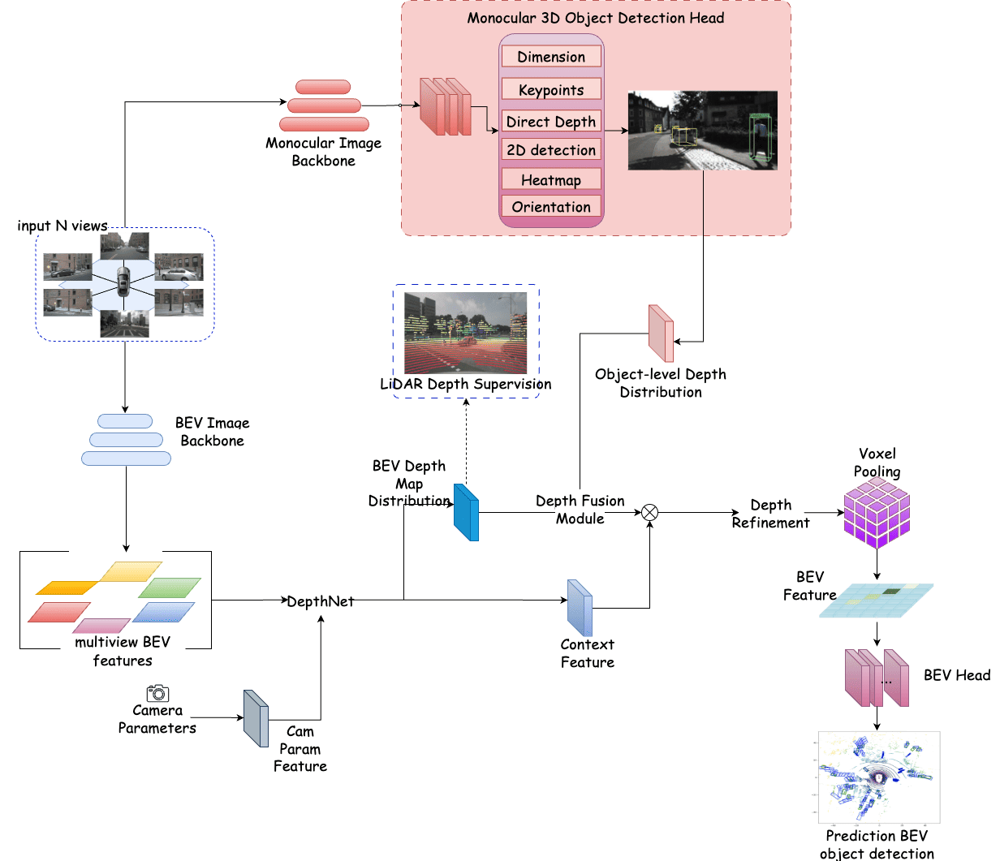

## BEVCorner
BEVCorner, a novel framework that synergistically integrates monocular and multiview pipelines for enhanced 3D object detection in autonomous driving. By fusing depth maps from Bird’s-Eye View (BEV) with object-centric depth estimates from monocular detection, BEVCorner enhances both global context and local precision, addressing the limitations of existing methods in depth precision, occlusion robustness, and computational efficiency. For more details, please refer to our paper (TBD).




## Quick Start
### Installation
**Step 0.** Install [pytorch](https://pytorch.org/)(v1.9.0).

**Step 1.** Install [MMDetection3D](https://github.com/open-mmlab/mmdetection3d)(v1.0.0rc4).

**Step 2.** Install requirements.
```shell
pip install -r requirements.txt
```
**Step 3.** Install BEVDepth(gpu required).
```shell
cd bevdepth/layers/backbones/DCNv2

. make.sh

cd ../../../..

python setup.py develop
```

Personal note
```shell
cp /root/.cache/torch/checkpoints/dla34-ba72cf86.pth /root/.cache/torch/hub/checkpoints/dla34-ba72cf86.pth
```  

### Data preparation
**Step 0.** Download nuScenes official dataset.

**Step 1.** Symlink the dataset root to `./data/`.
```
ln -s [nuscenes root] ./data/
```
The directory will be as follows.
```
BEVCorner
├── data
│   ├── nuScenes
│   │   ├── maps
│   │   ├── samples
│   │   ├── sweeps
│   │   ├── v1.0-test
|   |   ├── v1.0-trainval
```
**Step 2.** Prepare infos.
```
python scripts/gen_info.py
```

### Tutorials
**Run from VSCode.**
All the commands are provided in `.vscode/launch.json`. Refer to Debug code with [Visual Studio Code](https://code.visualstudio.com/docs/debugtest/debugging) on how to run them.

**Train.**
```
python [EXP_PATH] --amp_backend native -b 8 --gpus 8
```
**Eval.**
```
python [EXP_PATH] --ckpt_path [CKPT_PATH] -e -b 8 --gpus 8
```


## Cite BEVCorner
If you use BEVCorner in your research, please cite our work by using the following BibTeX entry:

(TBD)
